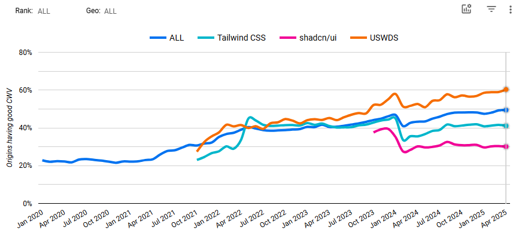

# 5. Design system

Date: 2025-05-13

## Status

Accepted

## Context

The AI Platform project requires a thoroughly tested and accessible design system. 

## Decision

The project team will use USWDS.

## Alternatives Considered

In parallel with the assessment of USWDS, Tailwind + shadcn/ui was also assessed. To do this, engineering built the footer of the site with each front-end technology and came together to discuss the pros and cons of each.

At the time of comparison, sites using USWDS pass core web vitals 60% of the time compared to 41% for Tailwind, 30% of the time for shadcn/ui, and 49% of the time for all technologies in the data set.



Additionally, the accessibility of the Tailwind + shadcn/ui raised some concerns. During the build of the related chat product, there was a large stream of work related to correcting accessibility issues. Furthermore, an inspection of the shadcn/ui site with [Axe](https://www.deque.com/axe/), [WAVE](https://wave.webaim.org/), and a light manual audit in the form of the tab key was able to surface several accessibility issues.

## Consequences

USWDS has first-class accessibility testing for its components, which was a driver for its selection for the project. While that means engineering will be writing components that are absent from USWDS and present in shadcn/ui, the engineers will have control over the markup. 

There will be some overrides of USWDS required to get the UI to closely resemble the mockups, and engineering has discussed a strategy for this.

Consider the following where a [button](https://designsystem.digital.gov/components/button/) is used.

```
<button class="usa-button usa-button--primary ai-button ai-button--primary" href="#">
  Button text
</button>
```

To clearly delineate the styles that are owned by the application, note that there is a corresponding style with an `ai-` prefix that corresponds to a USWDS-provided style that we'd like to override.

❌ Avoid this:

```css
/* override for USWDS */
.usa-button--primary {
  background-color: #123456; 
}
```

✅ Do this instead: 
```css
/* override for USWDS */
.ai-button--primary {
  background-color: #123456; 
}
```
