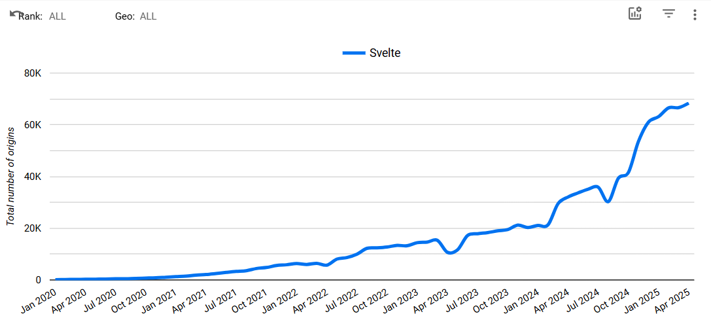

# 6. UI Library

Date: 2025-05-16

## Status

Accepted

## Context

The AI Platform project requires a UI library for user interactions on the client-side. 

## Decision

[Svelte](https://svelte.dev/) will receive first-class support.

## Alternatives Considered

At the time of this writing, the most popular JS interface library is React, which was also considered for the project.

As part of this assessment, engineering looked at an identical feature using the [Astro examples](https://github.com/withastro/astro/tree/main/examples/) for Svelte and React. Each implements a simple "counter" component that increments or decrements a number with a set of buttons as below:

The final result of the app size on disk are as follows:

| Framework | Total Size (kb) |
|-----------|-----------------|
| React     | 141.0           |
| Svelte    | 15.8            |

Traditional frameworks like React rely on a virtual DOM and synthetic events for updating the UI, whereas Svelte compiles components to vanilla JavaScript at build time. This approach ensures smaller bundles, faster execution, and efficient updates to the DOM as reflected in the tests.

## Consequences
Due to the project's goal at the time of this writing, it will act as a hub for the chat, console, API, and public site. 

The project's origin began with the usage of [Open WebUI](https://www.openwebui.com/) for the chat app, which also uses Svelte. It is believed that giving Svelte preference in this codebase will make the future integration work easier.

Additionally, we know that there will be charts and graphs and Svelte was originally created to [embed data visualizations](https://www.offerzen.com/blog/rich-harris-on-why-he-created-svelte), and there is a good fit with our product direction.

Svelte is currently funded by [Vercel](https://vercel.com/) which lowers the risk of stagnation or abandonment that comes with a newer library. 

Svelte's growth is currently trending upward with an increase from 41,540 origins using Svelte in September 2024 to 68,352 origins using it in April 2025.

